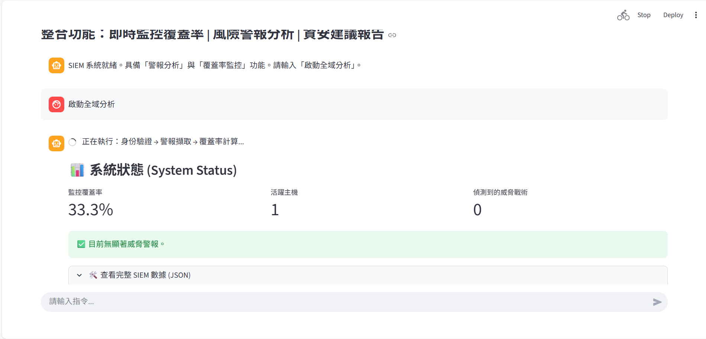
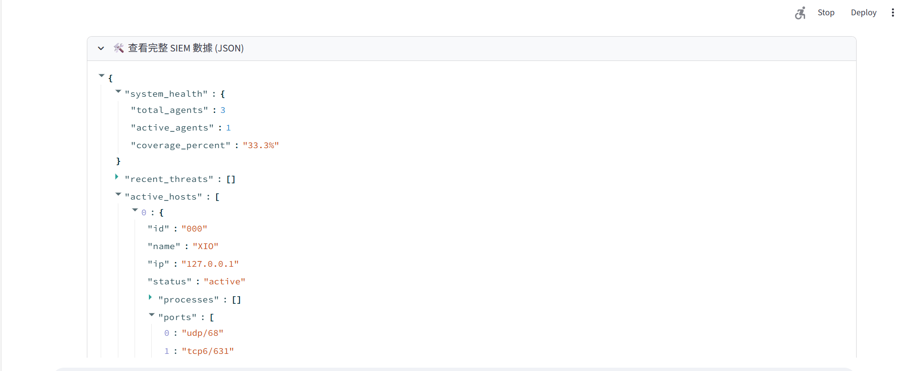
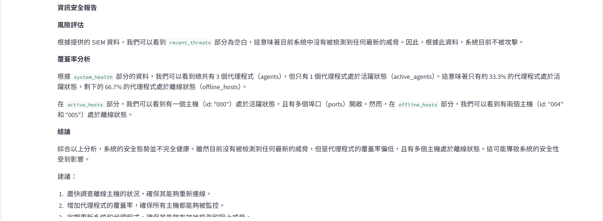

# Wazuh AI Security Ops Dashboard

> **An Intelligent SIEM Interface powered by Generative AI (Llama-3) & Wazuh API**
> 
> *結合生成式 AI 與資安監控，實現自動化威脅獵捕與戰情分析。*


## 專案簡介 (Introduction)

本專案是一個基於 **Wazuh SIEM** 的現代化資安戰情儀表板。透過整合 **NVIDIA NIM (Llama-3-70b)** 大型語言模型，將傳統繁雜的資安數據轉化為直觀的視覺化圖表與 AI 智能分析報告。

系統能夠即時監控 Agent 覆蓋率、自動擷取 MITRE ATT&CK 威脅警報，並由 AI 扮演資安長 (CISO) 角色，針對當前風險提供具體的修補建議。

## 核心功能 (Key Features)

* **即時戰情儀表板 (Live Dashboard)**
    * 可視化呈現系統監控覆蓋率 (Coverage)。
    * 即時統計活躍主機 (Active) 與離線主機 (Disconnected) 數量。
* **威脅獵捕 (Threat Hunting)**
    * 自動對接 Wazuh API，擷取 MITRE ATT&CK 框架下的高風險警報。
    * 偵測異常程序與未授權的網路連接埠 (Ports)。
* **AI 資安智囊 (AI Security Analyst)**
    * 利用 LLM 自動分析 JSON 格式的原始日誌。
    * 生成全中文的風險評估報告與防禦建議。
* **企業級整合**
    * 支援 Wazuh Token 自動化認證管理。
    * 相容於自簽憑證 (Self-signed Cert) 的內部環境。

## 🛠️ 技術架構 (Tech Stack)

* **Frontend**: Streamlit (Python)
* **Backend**: Wazuh API (v4.x)
* **AI Engine**: LangChain + NVIDIA NIM (Llama-3.1-70b-instruct)
* **Environment**: Docker / VirtualBox (Ubuntu Server & Windows Agent)

## 快速開始 (Quick Start)

### 1. 安裝依賴 (Installation)

您可以選擇直接安裝套件，或是使用 `requirements.txt` 安裝：

# 方法一：使用 requirements.txt (推薦)
```bash
pip install -r requirements.txt
```
# 方法二：手動安裝所有套件
```bash
pip install streamlit requests python-dotenv langchain-openai langchain-community
```
# 2. 環境設定 (Configuration)
本專案已附帶一個 .env 範本檔案（內容為 ******），請在專案根目錄確認 .env 檔案存在，並將其中的內容修改為您真實的 NVIDIA API Key：

# 請將下方的星號替換為您的真實 Key，例如: nvapi-xxxxx...
NVIDIA_API_KEY="nvapi-********************************"
(Wazuh 連線資訊與帳號密碼已內建於 app.py 中，請將****改成自己的帳密)

3. 啟動系統 (Run)
在終端機 (Terminal) 或 PowerShell 輸入以下指令啟動：
```bash
python -m streamlit run app.py
```
4.系統截圖

### 截圖一：



> **功能說明：**
> 此畫面展示了系統的即時監控覆蓋率、活躍主機數量，以及偵測到的威脅戰術統計，下方可看到 JSON 原始資料結構欄。

---

### 截圖二：



> **功能說明：**
> 此畫面展示 JSON 原始資料結構欄內的內容
---

### 截圖三：



> **功能說明：**
> 此畫面展示了 AI 扮演資安長 (CISO) 角色，針對當前警報數據所生成的全中文風險評估報告與防禦建議。

License

This project is created for the NTU GenAI Course (National Taiwan University). For educational purposes only.
